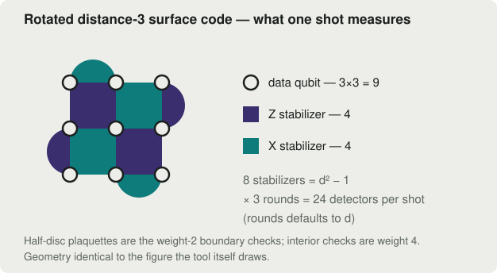
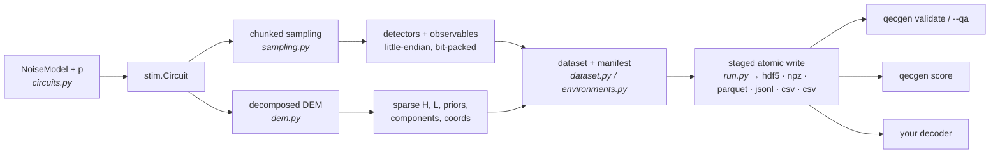
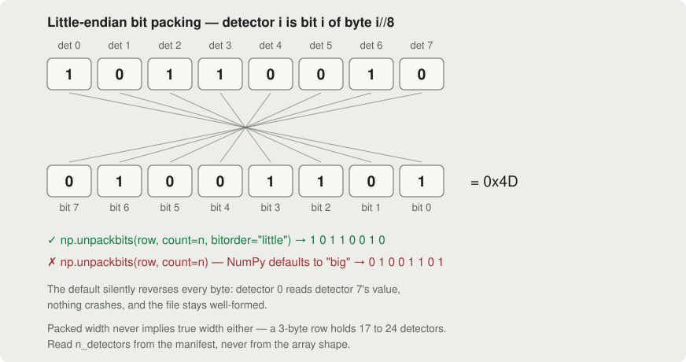
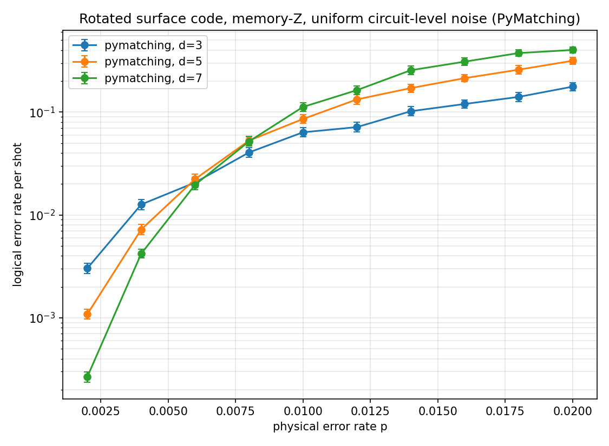
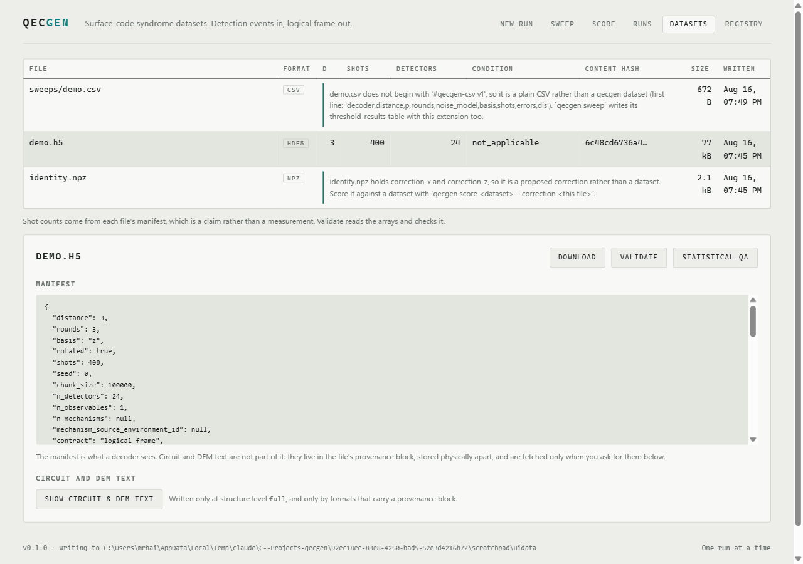
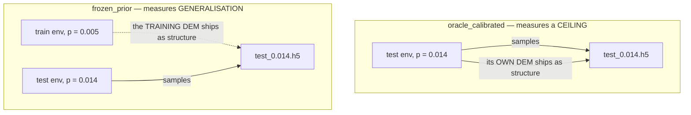

# qecgen

**A surface-code quantum error correction dataset generator for decoder benchmarking.**
Builds circuits with [Stim](https://github.com/quantumlib/Stim), samples detection events,
parses detector error models into sparse matrices, validates the output, and exports it
through a pluggable exporter layer — with every file carrying a manifest sufficient to
regenerate it exactly.


<p align="center">
  
</p>

**Every file this tool produces is a syndrome-to-logical-frame dataset**: per-shot
detection events mapped to per-shot logical observable flips. It contains no physical
Pauli fault labels. Read [`DATA_CONTRACT.md`](DATA_CONTRACT.md) before using the output
for anything — the three things a decoder can be asked to predict are not
interchangeable, and conflating them is the most likely way this project produces
confident, wrong results.

> **Nexus compatibility is not claimed.** The Nexus input format is unknown. No Nexus
> exporter exists. This README will not claim compatibility until a Nexus exporter passes
> a fixture supplied by the Nexus team. Adding one is a single new file — see
> [Adding an exporter](#adding-an-exporter).

**New to surface codes?** [qecgen-learn](https://github.com/HaiderAli3D/qecgen-learn) is a
six-lesson interactive course covering what a decoder sees, what the distance buys you, what
an error rate means, where the labels come from, what is in a file, and how to run a study
whose result supports the claim you want to make. About an hour, in the browser — take it
live at **[qecgen-learn.vercel.app](https://qecgen-learn.vercel.app)**. This README is the
reference; [`GUIDE.md`](GUIDE.md) is the task-oriented walkthrough.

---

## Contents

- [The sixty-second tour](#the-sixty-second-tour)
- [How it works](#how-it-works)
- [Installation](#installation)
- [Bit ordering, and why it matters](#bit-ordering-and-why-it-matters)
- [Noise models](#noise-models-exactly-which-channels-each-one-sets)
- [The CLI](#cli) — [`generate`](#qecgen-generate) · [`multi-env`](#qecgen-multi-env) ·
  [`drift`](#qecgen-drift) · [`sweep`](#qecgen-sweep) · [`score`](#qecgen-score) ·
  [`validate` / `inspect` / `formats`](#qecgen-validate--inspect--formats) ·
  [`ui`](#qecgen-ui)
- [HDF5 schema](#hdf5-schema)
- [JSONL schema](#jsonl-schema)
- [CSV schema](#csv-schema)
- [Oracle-calibrated vs frozen-prior](#oracle-calibrated-vs-frozen-prior)
- [Contract B](#contract-b)
- [Reproducibility](#reproducibility)
- [Validation vs QA](#validation-vs-qa)
- [Adding an exporter](#adding-an-exporter)
- [Comparison with decoder-bench](#comparison-with-decoder-bench)
- [API discrepancies and verification notes](#api-discrepancies-and-verification-notes)
- [Out of scope](#out-of-scope)
- [Development](#development)
- [License](#license)

---

## The sixty-second tour

```bash
pip install -e .

# A small dataset: distance 3, p = 1%, 4000 shots.
qecgen generate --distance 3 --p 0.01 --shots 4000 --chunk-size 1000 --seed 7 \
    --out data/first.h5

# Prove the file is what it claims to be, then look inside it.
qecgen validate data/first.h5
qecgen inspect  data/first.h5
```

Three things happen that you would otherwise have to build yourself:

1. **The terminal log is a complete record of the run.** Every command prints its fully
   resolved configuration — including every defaulted value — before doing any work, and
   finishes by reporting what actually landed:

   ```
   wrote data/first.h5  shots=4,000  content_hash=5cfe5aeff321d92f...
   ```

2. **The file describes itself.** The manifest inside it records the code parameters, the
   full noise channel vector, the seed, the chunk size, the library versions, the git
   commit and a content hash — enough to regenerate the file exactly, and enough for
   `validate` to check it without any outside knowledge:

   ```
   [PASS] detectors.packed_width: ceil(24/8) = 3, got 3
   [PASS] content_hash: manifest 5cfe5aeff321d92f... vs actual 5cfe5aeff321d92f...
   all structural checks passed
   ```

3. **Nothing is written to the path you read until the run finishes.** Output is staged
   in a sibling directory and committed atomically, so a cancelled or crashed run leaves
   no file rather than a plausible-looking broken one.

Rerun the same command and the `content_hash` matches. Change `--chunk-size` and it does
not — that is deliberate, and [Reproducibility](#reproducibility) explains why.

---

## How it works



A noise model resolves to an explicit **channel vector** (which of Stim's four noise
parameters are active, at what rate), which builds a rotated surface-code memory circuit.
The circuit is sampled in bounded-memory chunks — detection events and logical observable
flips, bit-packed by Stim itself. In parallel, the circuit's **detector error model** is
parsed into sparse `H` (detector incidence) and `L` (observable incidence) matrices with
priors and correlation structure, which is the same graph a matching decoder is built
from. Arrays, structure and a self-describing manifest are then written through one of
five exporters, atomically.

Everything downstream — validation, statistical QA, correction scoring, threshold sweeps,
the web UI — reads those files back through the same layer that wrote them.

---

## Installation

Requires Python 3.13+.

```bash
pip install -e .              # runtime
pip install -e ".[dev]"       # plus pytest, ruff, mypy, httpx
pip install -e ".[ui]"        # plus fastapi and uvicorn, for `qecgen ui`
pip install -e ".[decoders]"  # plus mwpf and fusion-blossom, for `sweep --decoder`
```

The `decoders` extra is **not** required to generate, validate or export a dataset — only
to run a decoder baseline against one. It is deliberately separate because both packages
are pre-1.0 Rust extensions, and a platform without a wheel would otherwise make `qecgen
generate` uninstallable, taking eight commands that never decode anything down with it.

The `ui` extra follows the same rule for the same reason: eight commands work without a
web stack, and none of them should become uninstallable if one fails to resolve. All four
of its packages ship a PEP 561 `py.typed`, so none of them needed an entry in the mypy
`ignore_missing_imports` list — the absence is the notable part.

Dependencies are pinned exactly, because dataset reproducibility depends on the Stim
version:

| Package | Pinned | Package | Pinned |
|---|---|---|---|
| stim | 1.16.0 | h5py | 3.15.0 |
| sinter | 1.16.0 | pyarrow | 25.0.1 |
| pymatching | 2.4.0 | matplotlib | 3.10.8 |
| numpy | 2.3.3 | typer | 0.27.1 |
| scipy | 1.16.2 | rich | 14.2.0 |

Verify the install:

```bash
ruff check . && ruff format --check .
mypy --strict qecgen tests
pytest -m "not slow"        # 473 fast structural tests
pytest -m slow              # 7 statistical and integration tests
```

The web UI needs one more step, because its bundle is built rather than committed:

```bash
cd frontend && npm ci && npm run build   # writes qecgen/ui/static
```

The suite is green without the `decoders` extra: tests needing `mwpf` are gated on
`importlib.util.find_spec`.

---

## Bit ordering, and why it matters

**Every packed array in every file is little-endian.** Every manifest records
`bit_order="little"`.

<p align="center">
  
</p>

NumPy's `packbits`/`unpackbits` default to `bitorder='big'`, which is the **opposite** of
the convention Stim and PyMatching use. Taking the default silently reverses the bits
within every byte and produces a well-formed file containing wrong data — detector 0
becomes detector 7, and nothing crashes.

Verified empirically against the installed libraries:

```
np.unpackbits(packed, axis=1, count=n_detectors, bitorder="little") == unpacked sample  -> True
np.unpackbits(packed, axis=1, count=n_detectors, bitorder="big")    == unpacked sample  -> False
```

Sinter's own decoder contract states it directly: *"All data taken and returned must be
bit packed with `bitorder='little'`."*

Rules followed throughout:

- Sampling always uses `sample(shots, separate_observables=True, bit_packed=True)`. Stim
  does the packing; we never pack ourselves.
- Any code path touching `packbits`/`unpackbits` passes `bitorder="little"` explicitly.
- Use `qecgen.sampling.unpack_bits(packed, n_bits)` rather than calling NumPy directly —
  it also refuses an array whose packed width disagrees with the bit count, because
  NumPy's `count=` zero-fills past the end of an under-wide array instead of raising.

**Packed width does not tell you the true width.** Packing pads to a byte boundary, so a
3-byte row could hold anywhere from 17 to 24 detectors. `n_detectors` and `n_observables`
are therefore explicit manifest fields, never inferred from array shape.

---

## Noise models: exactly which channels each one sets

The full channel vector is stored per environment in every manifest, so a results table
can state precisely which channels were active. A model name alone is not enough.

| Model | `after_clifford_depolarization` | `after_reset_flip_probability` | `before_measure_flip_probability` | `before_round_data_depolarization` | rounds |
|---|---|---|---|---|---|
| `code_capacity` | 0 | 0 | 0 | **p** | forced to 1 |
| `phenomenological` | 0 | 0 | **p** | **p** | distance |
| `stim_uniform_circuit_level` (default) | **p** | **p** | **p** | **p** | distance |

`STIM_UNIFORM_CIRCUIT_LEVEL` is named that way deliberately. Setting all four channels to
one value is **one valid synthetic convention, not a universal definition of
"circuit-level noise"**. Hardware-motivated models weight these channels differently, and
the threshold location moves when the convention changes.

`CODE_CAPACITY` forces `rounds=1` and **raises** if a conflicting `rounds` is passed,
rather than silently overriding it — a silent override would make the manifest disagree
with the file.

---

## CLI

Every command prints its fully resolved configuration before doing any work, so a terminal
log is a complete record of the run, including values that were defaulted rather than
passed.

### `qecgen generate`

Single-environment dataset.

```bash
qecgen generate --distance 5 --p 0.005 --shots 1000000 \
    --noise stim_uniform_circuit_level --format hdf5 --structure dem \
    --out data/d5_p005.h5
```

Add `--emit-mechanisms` for Contract B labels. Note this switches sampling to the DEM
sampler so all arrays come from one consistent draw (see [Contract B](#contract-b)).

`--structure {none,coords,dem,full}` decides how much of the error model travels with the
shots — from nothing, through detector coordinates, to the full sparse structure, to the
circuit and DEM text held in a separate provenance block.

### `qecgen multi-env`

Pooled dataset spanning several environments, shuffled with a seeded permutation so row
order carries no environment signal.

```bash
qecgen multi-env --distance 5 --p 0.003 --p 0.005 --p 0.008 --p 0.012 \
    --shots-per-env 250000 --out data/train_multi.h5
```

Each rate gets its own circuit, DEM and `EnvironmentSpec`; every shot carries an
`environment_id`. Non-`p` axes need `--base-p` and explicit values — the default rate
list is a list of physical error rates, not coordinates on some other axis, so reusing it
silently is refused:

```bash
qecgen multi-env --drift-axis xz_bias --base-p 0.008 --p 0.5 --p 4.0 --p 16.0 \
    --shots-per-env 100000 --out data/train_bias.h5
```

### `qecgen drift`

Training set plus drifted test sets, under an **explicit, recorded** condition — the
command behind the generalisation study. See
[Oracle-calibrated vs frozen-prior](#oracle-calibrated-vs-frozen-prior) for why the
condition is the whole point.

```bash
qecgen drift --distance 5 --train-p 0.005 --test-p 0.007 --test-p 0.010 --test-p 0.014 \
    --condition frozen_prior --out data/drift/
```

All files in the set are staged and committed together — a `train.h5` without its
`test_*` siblings is a trap, not a partial result, so an interrupted run produces
nothing rather than half a study.

### `qecgen sweep`

Sinter-driven threshold sweep. `--max-errors` is the primary stopping condition;
`--max-shots` is a ceiling.

```bash
qecgen sweep --distances 3 --distances 5 --distances 7 \
    --p-range 0.002:0.020:10 --max-errors 300 --max-shots 2000000 \
    --workers 8 --out results/sweep.csv
```

That exact command produced this plot — about 1.2 million shots of real sampling, also
committed as the evidence behind the numbers the
[teaching site](https://qecgen-learn.vercel.app) displays:

<p align="center">
  
</p>

Reading it: **below the crossing, a bigger code is a better code** — at p = 0.002 each
step from d to d+2 divides the logical error rate by Λ ≈ 3.4 — and above it the ordering
reverses, which is what makes the crossing an estimate of the threshold. For this run the
sidecar reports `crossing_p: 0.008` with Λ = 3.38 [3.12, 3.66] at p = 0.002, falling to
1.03 [0.95, 1.11] (no longer suppressing) by p = 0.006.

Emits three files, all staged and committed together like every dataset write: the CSV, a
log-y plot with Clopper-Pearson error bars on every point (one curve per (decoder,
distance); zero-error points appear as downward carets at their upper bound), and a
threshold summary. The plot and summary are named by *replacing* the `.csv` suffix —
`results/sweep.csv` is joined by `results/sweep.png` and `results/sweep.threshold.json`.
A rate is never emitted without an interval.

**This CSV is a results table, not a dataset.** It shares its extension with the `csv`
export format and nothing else: it has no `#__manifest__` header, `qecgen validate` refuses
it by name, and the UI's dataset browser lists it as *not a qecgen dataset* rather than as
corrupt. See [CSV schema](#csv-schema) for the format that is a dataset.

**Decoder baselines.** `--decoder` is repeatable and defaults to `pymatching`:

```bash
qecgen sweep --decoder pymatching --decoder hypergraph_union_find \
    --distances 3 --distances 5 --p-range 0.005:0.015:3 --max-errors 500
```

Names are validated against `sinter.BUILT_IN_DECODERS` **before** any collection starts,
and a name whose backing package is absent is reported as an install instruction rather
than as a typo. sinter discovers both problems only inside a worker, after every circuit
in the grid has been built.

> **`hypergraph_union_find` is not the union-find you may be expecting.** It is MWPF's
> hypergraph solver, not the Delfosse-Nickerson union-find usually described as "faster
> and slightly less accurate than MWPM". Measured here it is *more* accurate than
> PyMatching at every sampled point (d=3 and d=5, p ∈ {0.005, 0.010, 0.015}). Nothing in
> the test suite asserts an accuracy ordering between the two, because the ordering is a
> property of these particular decoders rather than of this code.

Both decoders receive the **same** DEM: sinter derives one per task with
`decompose_errors=True, approximate_disjoint_errors=True` and shares it. That DEM is
byte-identical to the one `qecgen` exports, verified for uniform circuit-level noise and
for the `xz_bias` `PAULI_CHANNEL_1` rewrite.

#### Threshold crossing and exponential suppression

Both are **reported, never asserted**. The `.threshold.json` sidecar holds, per decoder,
the bracketing crossing and one suppression fit per `p`. The crossing is claimed only
from *separated* intervals: the largest distance's interval must sit entirely below the
smallest's at some lower `p` and entirely above it at the reported one — overlapping
intervals claim nothing, so two statistically indistinguishable points (or two zero-error
points in a quick sweep) are never reported as a crossing:

```
pymatching  crossing: p ~ 0.009
  p=0.001    Lambda=7.01 [5.33, 9.22] d=3,5,7 chi2/dof=1.02
  p=0.009    Lambda=0.785 [0.727, 0.847] d=3,5,7  (at or above crossing)
```

The model is `p_L(d) = A * Lambda^(-(d+1)/2)`, fitted by weighted least squares on
`log p_L`, weighting each point by its Clopper-Pearson interval width in log space. With
exactly two distances it degenerates to the pairwise ratio `p_L(d) / p_L(d+2)`, so nothing
is lost against reporting ratios; with three or more it also yields a residual, which is
the only honest signal that the points are in the exponential regime at all.

Three deliberate choices:

- **Zero-error points are excluded, never pseudo-counted.** No `0.5/n`, no Jeffreys, no
  `max(k, 1)` — substituting a count fabricates a measurement. The excluded distances are
  named in `excluded_zero_error`. It is almost always the *largest* distance that produces
  one, so dropping it removes the most-suppressed point and biases `Lambda` **downward**:
  a reported `Lambda` under-states suppression whenever that list is non-empty.
- **`Lambda < 1` is reported, not clamped.** Above threshold, larger distance genuinely
  hurts.
- **`suppressing` is true only when the whole interval lies above 1.** An interval
  straddling 1 means the data do not establish suppression, which is the honest answer.

Points that hit `--max-shots` before reaching `--max-errors` are listed as
`censored_points` — a measured fact about what happened, not a heuristic warning about
what might.

### `qecgen score`

Score a **supplied** physical Pauli correction by its logical effect — "apply the
correction, check the logical qubit matches", done exactly.

```bash
qecgen score data/d5_p005.h5 --correction proposed.npz
```

`proposed.npz` holds `correction_x` and `correction_z`, each little-endian bit-packed
`uint8 (shots, ceil(n_data_qubits/8))` over the data qubits. Pass `--unpacked` to supply
bool `(shots, n_data_qubits)` arrays instead and let `qecgen` pack them, so a third party
never calls `np.packbits` themselves and cannot take NumPy's big-endian default.

Measured on a d=3, p=0.01, 20k-shot dataset:

| correction | logical error rate |
|---|---|
| identity (all zeros) | `0.19245 [0.18701, 0.19798] (3849/20000)` — exactly the raw uncorrected rate |
| oracle (flip iff the observable flipped) | `0.00000 [0.00000, 0.00018] (0/20000)` |
| MWPM prediction lifted to a Pauli | `0.05525 [0.05212, 0.05851] (1105/20000)` |

**This is not Contract C.** Contract C — inferring which physical fault occurred from a
syndrome — remains refused, because it inverts a deliberately many-to-one map. Scoring a
correction someone else proposes is the forward direction of the same arrow: a
deterministic, single-valued function with no tie-breaking anywhere. See
[`DATA_CONTRACT.md`](DATA_CONTRACT.md).

The logical operators are rebuilt from a **noiseless** circuit generated from the
dataset's own decoder-visible manifest parameters, which is sound because the correction
schema is a property of the code rather than of the noise — asserted as a test across
noise model, `p` and the `xz_bias` rewrite. So scoring a `frozen_prior` test file never
reads that file's own error model.

### `qecgen validate` / `inspect` / `formats`

```bash
qecgen validate data/d5_p005.h5          # fast structural checks
qecgen validate data/d5_p005.h5 --qa     # plus slow statistical checks
qecgen inspect  data/d5_p005.h5          # manifest and environment table
qecgen inspect  data/d5_p005.h5 --show-text   # plus circuit/DEM text, if stored
qecgen formats                           # registered exporters
```

`--show-text` prints the circuit and DEM text from the provenance block when the file was
written at `--structure full`, and says plainly that no provenance is stored otherwise.

### `qecgen ui`

The three dataset-producing commands in a browser, for when you would rather not remember
which flags interact.

```bash
cd frontend && npm ci && npm run build   # once, and after any frontend change
qecgen ui --data-root data               # http://127.0.0.1:8765
```

<p align="center">
  
</p>

Three pages: a run form with a live cost preview, a run list with live progress and
cancellation, and a dataset browser with manifests and validation. It covers `generate`,
`multi-env` and `drift`; `sweep`, `score` and `inspect` stay terminal-only.

<p align="center">
  
</p>

Three things about it are deliberate rather than incidental.

**It is loopback-only, and that is not configurable.** The API writes files and starts
processes for whoever can reach it, with no authentication. A non-loopback `--host` is
refused by name rather than quietly accepted; use an SSH tunnel if you need it elsewhere.
Every path that arrives from the browser is resolved and required to sit under
`--data-root` before it is used.

**Each run is a subprocess, not a thread.** Stim's sampler holds the GIL. Measured here
with the job on a thread and an asyncio loop beside it: median event-loop lag 102 ms at
d=9 with a 100k chunk, worst case 1033 ms at a 1M chunk. The same work in a subprocess
left the loop at 13 ms, which is Windows timer granularity. A server that freezes for a
second at a time cannot serve the cancel request, which is the one request that matters
during a long run.

**Nothing is written to the path you will read until the run finishes.** Output is staged
in a sibling directory and moved into place with `os.replace`, so a cancelled or crashed
run leaves no file rather than a plausible-looking broken one. The browser also never
lists a dataset by reading all of it: manifests come from the cheap place in each format,
and a file that cannot be read is listed with the reason attached rather than hidden.

The preview panel is the one thing the terminal cannot do. It builds the circuit and DEM
without sampling, so before you commit it can tell you the detector and mechanism counts,
the packed row width, the file size, and whether the run will stream or hold every shot
in memory.

Same inputs produce the same bytes as the CLI — verified by matching `content_hash`
between a `qecgen generate` run and the same run submitted through the browser.

---

## HDF5 schema

The primary format, and the only streaming-capable one.

```
/detectors        uint8  (shots, ceil(n_detectors/8))    little-endian bit-packed
/observables      uint8  (shots, ceil(n_observables/8))
/environment_ids  int32  (shots,)                        present for multi-environment
/mechanisms       uint8  (shots, ceil(n_mechanisms/8))   present with --emit-mechanisms
/dem/                                                    present per --structure
    H_indices, H_indptr, H_shape       CSC of (n_detectors, n_mechanisms)
    L_indices, L_indptr, L_shape       CSC of (n_observables, n_mechanisms)
    priors               float64 (n_mechanisms,)
    detector_coords      float64 (n_detectors, coord_dim)   (x, y, t)
    component_parent     int32   (n_components,)            parent_mechanism_id
    component_index      int32   (n_components,)
    component_det_flat   int32   ragged detector ids, concatenated
    component_det_offset int64   (n_components + 1,)
    component_obs_flat   int32
    component_obs_offset int64   (n_components + 1,)
/provenance/                                             present only at --structure full
    environments         JSON attribute: per-environment circuit and DEM text
    warning              "PROVENANCE ONLY - a decoder must not read this group"
```

Root attributes: `manifest` (full JSON), plus `bit_order`, `contract`, `n_detectors`,
`n_observables`, `shots`, `distance`, `rounds`, `chunk_size`, `drift_condition`,
`qecgen_version` mirrored as scalars so `h5dump -A` is readable without parsing JSON.

CSC `data` values are not stored: `H` and `L` are binary incidence matrices, so every
stored entry is 1 by construction.

`--structure {none,coords,dem,full}` controls how much of this is written, so a decoder
can be run both with and without the graph structure PyMatching gets for free.

### One column per mechanism, not per component

`H` has **one column per independent `error(...)` instruction**. Stim's decomposed DEM
writes correlated mechanisms as graphlike components joined by `^` separators; those
components share a single probability and belong to one mechanism.

Measured on d=3, r=3, uniform circuit-level p=0.01:

| Quantity | Value |
|---|---|
| `error(...)` instructions = `n_mechanisms` | **286** |
| Total components | 556 |
| Mechanisms containing a `^` separator | 208 |

Emitting one column per component would give **556 columns instead of 286**, each
carrying a duplicated copy of the parent probability — a different noise model from the
one Stim simulated. Components are preserved separately, keyed by `parent_mechanism_id`.

### Column weight is checked per component, not per mechanism

This corrects a natural but wrong expectation. Measured mechanism detector-weights:

```
weight 1 -> 24    weight 2 -> 115    weight 3 -> 98    weight 4 -> 49
```

Only 139 of 286 mechanisms touch one or two detectors. That is **not** a parsing bug: a
decomposed mechanism with two components legitimately touches up to four detectors. The
graphlike guarantee applies to components (each ≤ 2 detectors), which is what
`validate.py` asserts. Mechanism weight is *reported*, never asserted — asserting it would
produce a validator that fails on correct data.

---

## JSONL schema

The JSON-facing format. Line-delimited, so a consumer can read the manifest and the full
DEM structure without touching a single shot.

```
line 1        {"__manifest__": { … }}
line 2        {"__structure__": { … }}          present iff structure_level != none
lines 3..N    {"shot": 0, "detectors": "0100…", "observables": "1",
               "environment_id": 3, "mechanisms": "0010…"}
```

The structure object mirrors the HDF5 group key for key — `H_indices`, `H_indptr`,
`H_shape`, the same for `L`, `priors`, `detector_coords`, plus `level`, `n_detectors`,
`n_observables`, `n_mechanisms`, `coord_dim`. CSC `data` values are omitted for the same
reason HDF5 omits them. `components` are **nested objects**, not the flattened
value/offset pairs HDF5 and NPZ use: those exist only because HDF5 has no ragged type, and
the offset form carries a specific silent failure — an off-by-one re-segments every
component after it while still round-tripping, because the read side is symmetrically
wrong.

**Bit strings: `s[0]` is index 0.** The leftmost character is the *lowest* index, matching
the little-endian packing everywhere else. **Do not use `int(s, 2)`** — that treats the
leftmost character as most-significant and reverses the index across the whole file. This
is the string-form counterpart of the `bitorder` trap above, and a round-trip test cannot
catch it: reversing on write and again on read is perfectly self-consistent. It is
asserted against the packed bytes instead. Reading back, every bit string must carry
exactly the manifest's declared width — a uniformly short row would otherwise repack with
fabricated zero bits, so it is refused instead.

Floats round-trip **bit-exactly**. Python's JSON encoder uses `repr`, which is
shortest-round-trip for IEEE754 doubles; verified over 10k random float64 plus denormals
and 1e±300. `allow_nan=False` on write and a rejecting `parse_constant` on read, so a bare
`NaN`/`Infinity` token — not valid JSON, and rejected by Go and serde_json — can neither be
written nor silently accepted. Ragged detector coordinates, which `parse_dem` pads with
NaN, are encoded as JSON `null`.

Structure-line size depends on distance, never on shot count: 61 KiB at d=3, ~434 KiB at
d=5, ~1.5 MB at d=7.

> **Reader note.** Go's `bufio.Scanner` defaults to a 64 KB token cap and fails on the
> structure line of *every* d≥3 file. One call fixes it:
> `scanner.Buffer(make([]byte, 0, 64<<10), 64<<20)`. Python, `jq`, Node and Java need
> nothing.

JSONL is a JSON interface. **It is not the Nexus interface** — no fixture from the Nexus
team has been run against it.

**JSONL will not carry provenance, at any level.** The idiomatic reader for this format is
`for line in f: json.loads(line)` — a complete, working reader that would ingest the
provenance block along with the shots, and under `FROZEN_PRIOR` that block is exactly the
distribution the condition exists to withhold. Asking for `--structure full` therefore
produces a file whose recorded `structure_level` is `dem`: the decoder-visible payload is
identical either way, and recording `full` over a file containing no circuit text would be
a claim the reader has no way to check. Use `hdf5`, `npz` or `csv` when the text has to
travel with the shots.

---

## CSV schema

The spreadsheet-facing format, and the only text format that carries all three payloads.
Everything before the first non-comment line is header; everything after is one row per
shot.

```
#qecgen-csv v1
#__manifest__   {...}
#__structure__  {...}          present iff structure_level != none
#__provenance__ {...}          present iff structure_level == full
shot,environment_id,det_0,…,det_23,obs_0,mech_0,…
0,0,0,1,…,1,0,…
```

`pandas.read_csv(path, comment="#")` and `numpy.genfromtxt(path, comments="#")` read the
table with no other argument.

**Every bit is its own column.** One `0`/`1` column per detector, observable and mechanism,
named for its index, unpacked from the little-endian packing. That is the point of the
format, and it also sidesteps the `int(s, 2)` trap JSONL carries — there is no bit string
here to reverse. The cost is size: expect roughly one character per bit plus a separator,
which makes CSV the largest format on disk. It warns above 100,000 shots.

**Header order is normative.** The magic line is first so a `.csv` that is not a dataset is
refused by name rather than by a confusing complaint about a missing column; the manifest
is second so a reader obtains it in two `readline` calls without touching the structure
line, which is 1.5 MB at d=7. `qecgen inspect` and the dataset browser both depend on that.
Each header line is `#key`, one space, then one JSON object — read with plain `readline`,
never through a CSV parser: `csv.field_size_limit()` defaults to 131072, so a quoted
metadata field would make the file unreadable by the stdlib parser at every distance.

**A `.csv` without the magic line is not a dataset.** `qecgen sweep` writes its
threshold-results table with the same extension. Every reader here refuses such a file by
name rather than guessing a schema from its columns, and the dataset browser lists it as
*not a qecgen dataset* rather than as corrupt — an intact results table should never wear
a corruption flag.

**Do not sort the rows.** The `shot` column must equal the row index, and reading refuses a
file where it does not. Sorting is the one thing a spreadsheet makes trivially easy, and it
severs the correspondence between a shot's detector bits, its `environment_id` and its
mechanism labels while leaving a perfectly well-formed file. Re-saving from a spreadsheet is
otherwise safe: a byte-order mark and CRLF line endings are both tolerated, while `TRUE`/
`FALSE` and empty cells are refused rather than coerced.

**A truncated CSV still parses.** The manifest is in the header, so a file cut short reads
cleanly and lists with a healthy-looking shot count. Only `qecgen validate` compares
`manifest.shots` against the rows actually present. Same trap as JSONL, same answer.

**Provenance is written at `full`, and the wall is thinner here than elsewhere.** A reader
that does not filter `#` lines does not find the table at all, so the step that locates the
data is the same step that drops the text — which is why CSV can carry it where JSONL will
not. But the text still shares a byte stream with the decoder-visible rows. Prefer HDF5 for
a `--structure full` file a decoder will be pointed at, and reserve full-level CSV for
audit.

---

## Oracle-calibrated vs frozen-prior

The distinction that decides whether the drift study means anything.



- **`ORACLE_CALIBRATED`** — structure exported with a test file is derived from **that
  file's own environment**.
- **`FROZEN_PRIOR`** — structure exported with a test file is derived from the **nominated
  training environment**.

If a test set at p = 0.010 ships with `--structure dem` where the DEM was built at
p = 0.010, the decoder has been handed the true test-time noise distribution. Any claim of
generalisation to unseen noise is then unsupported, because nothing was unseen.

Both are legitimate experiments. `ORACLE_CALIBRATED` measures a ceiling;
`FROZEN_PRIOR` measures generalisation. The condition is recorded in the manifest as
`drift_condition`, alongside `structure_source_environment_id` so the choice is auditable
from the file rather than taken on trust. It is never inferred from whichever DEM happened
to be in scope.

Verifiable directly:

```python
train = get_exporter("hdf5").read(Path("data/drift/train.h5"))
test = get_exporter("hdf5").read(Path("data/drift/test_0.014.h5"))
np.allclose(test.structure.priors, train.structure.priors)  # True under frozen_prior
test.meta.structure_dem_sha == train.meta.structure_dem_sha  # True: same source DEM
```

### The manifest is decoder-visible; provenance is not

Freezing the *numbers* is not sufficient. A test file also has to avoid describing its own
error model in words. The manifest therefore **never** contains circuit or DEM text:

| Location | Contents | Decoder may read |
|---|---|---|
| root `manifest` attribute | all parameters: distance, rounds, channels, axis, seed, hashes | **yes** |
| `dem/` group | H, L, priors, components, coordinates, from whichever environment the condition nominates | **yes** |
| `provenance/` group | per-environment circuit and DEM **text**, written only at `--structure full` | **no** |

Under `FROZEN_PRIOR` the `provenance/` group contains the *test* environment's own DEM,
which is exactly what the condition withholds. It is kept for auditing but separated
physically, so reading the manifest cannot expose it. `structure_dem_sha` (a BLAKE2b-128
digest; the algorithm is named in `structure_dem_algorithm`) lets a reviewer confirm which
environment supplied the structure without reading any text.

The parameters in the manifest remain sufficient to regenerate every environment, so
dropping the text costs no reproducibility.

### Drift axes

`--drift-axis` is not limited to `p`, because sweeping the uniform rate alone mostly tests
interpolation within one synthetic family. Held-out noise *families* are stronger evidence
of invariance than a held-out rate.

| Axis | Meaning | Unbiased point |
|---|---|---|
| `p` | the uniform rate itself | — |
| `measurement_ratio` | measurement error scaled independently of gate error | 1.0 |
| `xz_bias` | `pz / (px + py)` on single-qubit data noise | 0.5 |

Adding an axis is one function plus one entry in `AXIS_BUILDERS`, plus its domain check
and unbiased point — all three registries fail closed on an axis they do not know.

**`xz_bias` scope, stated precisely.** `stim.Circuit.generated` exposes only four
*symmetric* scalar probabilities and cannot express unequal X/Z rates at all. The bias axis
therefore rewrites `DEPOLARIZE1(p)` into `PAULI_CHANNEL_1(px, py, pz)` on Stim's generated
circuit, preserving the total single-qubit error probability.

It rewrites **every** `DEPOLARIZE1`, which in a generated surface code means both
`before_round_data_depolarization` (data noise) **and** `after_clifford_depolarization`
applied after single-qubit Cliffords. An earlier version of this README claimed only data
noise was affected; that was wrong, and a gate-noise-only circuit demonstrates it. The
manifest records the true scope as `bias_scope`.

Two-qubit `DEPOLARIZE2` noise **is** left symmetric: biasing it correctly needs the
15-parameter `PAULI_CHANNEL_2` and a convention for correlated two-qubit bias that nobody
has specified. So a dataset on this axis carries biased single-qubit noise (data and gate)
and unbiased two-qubit gate noise.

At `eta = 0.5` the rewrite gives `px = py = pz = p/3`, the depolarising point. The
resulting DEM is not bit-identical to the one built from `DEPOLARIZE1` — it agrees on
mechanism support exactly and to first order in p, with an O(p²) residual from Stim's
channel-composition arithmetic (`diff/p² ≈ 0.356`, constant across p = 1e-2, 1e-3, 1e-4).
An isolated single-channel comparison agrees to 1e-16, confirming the formula is exact and
only the composition differs.

---

## Contract B

`--emit-mechanisms` records which DEM mechanisms fired per shot.

These are **abstract mechanisms in the decomposed noise model, not gate-level physical
Pauli faults.** The mechanism index is an artifact of Stim's DEM construction order and is
not portable across noise models or distances. A decoder trained on these targets is
learning to invert Stim's DEM construction.

With `--emit-mechanisms`, **all three arrays come from the DEM sampler**
(`dem.compile_sampler(...).sample(n, bit_packed=True, return_errors=True)`), not from the
circuit's detector sampler. Sampling the circuit and the DEM separately would give two
independent RNG streams, so the mechanism labels would not explain the detection events
stored beside them. Sampling the DEM reproduces the same detector/observable distribution,
so Contract A targets remain valid. The suite asserts the invariant directly:
`H @ mechanisms == detectors` and `L @ mechanisms == observables` (mod 2), row for row.

Pooling Contract B labels across environments is rejected when their mechanism counts
*or enumeration order* differ, since column *k* would then mean a different mechanism in
different environments — matching counts are necessary but not sufficient.

---

## Reproducibility

Determinism is **content-based, not file-based**. Manifests contain timestamps and git
commits, so byte-identical files are not a meaningful test. Every manifest carries a
`content_hash` over array dtype, shape and bytes only, alongside
`content_hash_algorithm: "blake2b-256"`.

The algorithm is named because it is externally checkable. This field was previously called
`content_sha256` while computing BLAKE2b, so any independent verification attempted with
the advertised algorithm would have failed.

**Chunk size is part of the reproducibility contract.** Stim guarantees seeded
reproducibility only under matching version, machine characteristics and call structure.
Changing the chunk size changes the sequence of `sample()` calls against one seeded
sampler, and therefore changes the sample stream. `chunk_size` is recorded in every
manifest; reproducing a file requires matching it.

Seeds are threaded explicitly everywhere. No global RNG state is touched. Per-environment
and shuffle seeds are derived from the master seed via `numpy.random.SeedSequence`
spawning, so the whole run is reproducible from one integer.

Memory is bounded where it matters. Sampling is chunked (default 100,000 shots), and
`qecgen generate` routes through the streaming HDF5 writer whenever the format is HDF5 and
`--shots` exceeds one chunk, so peak memory stays flat regardless of dataset size.

Two honest limits. Non-HDF5 formats have no incremental writer and still materialise, so
keep NPZ, Parquet, JSONL and CSV runs modest — CSV is the largest of them on disk, writing
one character per bit plus a separator, and it warns above 100,000 shots. `multi-env` needs
all shots resident to apply the seeded permutation, so its peak memory scales with total
shot count; that is the price of a shuffle that provably preserves per-shot correspondence.

---

## Validation vs QA

Deliberately separate modules. Mixing deterministic structural checks with statistical ones
produces a default suite that fails for sampling reasons, and a suite that fails
intermittently is a suite that gets ignored.

**`validate.py`** — fast, deterministic, runs by default. Shapes and dtypes against the
manifest, packed widths equal `ceil(n/8)`, bit order recorded, all-zero detectors and
observables at p = 0, content hash, DEM shape agreement (including the mechanism count a
Contract B label array indexes), per-component weight bound, environment id and declared
shot-count correspondence.

**`qa.py`** — slow, opt-in via `--qa` or `pytest -m slow`. Every comparison is between
**Clopper-Pearson intervals**, never point estimates, with adaptive shot counts targeting a
minimum number of observed logical failures.

The estimated threshold crossing is reported as a **result**, never asserted against a
hardcoded value. The commonly quoted 0.5–1% figure depends on the channel convention,
rounds, basis and decoder, so it is a sanity range to print, not a test to fail on.

The validation oracle is built with `pymatching.Matching.from_detector_error_model(dem)` on
the original decomposed DEM object — never reconstructed from our own `H`, which would only
validate the parser against itself.

---

## Adding an exporter

Once the Nexus format is known, adding it is one file.

1. Create `qecgen/exporters/nexus.py` with a class satisfying the `Exporter` protocol
   (`qecgen/exporters/base.py`): properties `format_name`, `extension`, `streaming`,
   `structure_round_trip`, `carries_provenance`, and methods
   `write(dataset, path, structure_level)` and `read(path)`. The last two properties are
   live, not decorative — the parametrised tests and `qecgen formats` both read them, so
   declaring `structure_round_trip` enrols the format in the exact-equality structure
   round-trip contract, and declaring `carries_provenance` commits it to writing the
   circuit and DEM text at `full`. A format that declines either must record the level it
   can actually deliver; `recorded_structure_level` applies that rule for you.
2. Register it in `qecgen/exporters/__init__.py` by adding one entry to `EXPORTERS`.
3. The parametrised round-trip tests in `tests/test_exporters.py` pick it up
   automatically from the registry — no test changes needed there.
4. Two front-end dispatches are **not** derived from the registry and need one entry each:
   `qecgen/ui/datasets.py::_MANIFEST_READERS` (the cheap listing path — omitting it makes
   every file of the new format list as *unreadable*) and `qecgen/cli.py::_PROVENANCE_READERS`
   (only if the format carries provenance; the "no provenance stored" message is built
   from its keys). Both are covered by tests that fail if you forget. If the format can
   produce its manifest without reading its shots, wire it into `cli._read_manifest_only`
   too. And if the new extension can also name a file qecgen writes for another purpose —
   as `.csv` does, for `qecgen sweep` — the reader must raise `NotAQecgenDatasetError`,
   which is the distinction the dataset browser uses to say "not ours" rather than "broken".

The round-trip contract is: `read(write(d))` reproduces every array and every manifest
field exactly. Structure round-trip is required only for formats that claim it.

```python
class NexusExporter:
    @property
    def format_name(self) -> str:
        return "nexus"

    @property
    def extension(self) -> str:
        return ".nxs"

    @property
    def streaming(self) -> bool:
        return False

    @property
    def structure_round_trip(self) -> bool:
        return False

    def write(self, dataset, path, structure_level=StructureLevel.NONE): ...
    def read(self, path): ...
```

---

## Comparison with `decoder-bench`

`decoder-bench` (Maurya, Viszlai, Raveendran, Das, Tannu, IISWC 2025) is a published
Stim-based framework producing HDF5 QEC traces for this kind of benchmarking. `qecgen`
takes **no dependency on it**; the comparison exists because alignment with a published
convention is cheap insurance if a client turns out to expect something shaped like it.

**Scope of this comparison:** the repository's landing page documents its HDF5 files at the
level of *syndromes*, *observables* and *metadata* groups. Field-level schema is in its
source (`sampler.py`, `eval.py`, `decoders.py`) and the associated Zenodo dataset, which
were **not read directly**. The agreements below are therefore at the conceptual level, and
this section should be re-checked against the actual files before being relied on.

| Aspect | decoder-bench | qecgen | Why |
|---|---|---|---|
| Container | HDF5 | HDF5 | Agrees. Chosen for the same reasons: chunked, compressible, self-describing. |
| Syndrome data | binary syndrome measurements | `detectors`, bit-packed uint8 | Agrees conceptually. We store **detection events**, and pack them, to keep files ~8x smaller and match Stim/PyMatching's native format exactly. |
| Observables | logical measurement outcomes | `observables`, separate array | Agrees. `separate_observables=True` on every sample call; observables are never mixed into the detector array. |
| Metadata | code parameters, noise model, simulation settings | JSON `manifest` attribute | Agrees in intent. We additionally require the manifest be **sufficient to regenerate the file**, including library versions, git commit, seed and chunk size. |
| Noise models | code-capacity, phenomenological, circuit-level | same three | Agrees. We rename the third `stim_uniform_circuit_level` because setting all four channels to one `p` is a convention, not a definition. |
| Per-environment structure | not described | `EnvironmentSpec` list, no top-level `p` | **Diverges.** Multi-environment datasets are a first-class requirement here; promoting `p`/`circuit`/`dem` to the dataset level breaks the moment there is more than one environment. |
| DEM export | not described | `dem/` group, one column per `error(...)` | **Diverges.** Needed for the frozen-prior condition and to give a learning decoder the same structure PyMatching receives. |
| Drift condition | not described | `drift_condition` + `structure_source_environment_id` | **Diverges.** Specific to this contract's generalisation study. |

---

## API discrepancies and verification notes

Signatures were verified by introspecting the installed libraries rather than assumed from
documentation.

- **`CompiledDetectorSampler.sample`** — installed signature is
  `sample(shots, *, prepend_observables=False, append_observables=False,
  separate_observables=False, bit_packed=False, dets_out=None, obs_out=None)`. Matches the
  assumed usage.
- **`CompiledDemSampler.sample`** — installed signature is
  `sample(shots, *, bit_packed=False, return_errors=False, recorded_errors_to_replay=None)`.
  `return_errors` exists as assumed. **It always returns a 3-tuple**; with
  `return_errors=False` the third element is `None` rather than the tuple being shorter.
- **`stim.Circuit.generated`** — the four noise parameters are the *only* noise controls.
  There is no parameter for asymmetric X/Z rates, which is why `xz_bias` rewrites the
  circuit.
- **`Matching.decode_batch`** — supports `bit_packed_shots` and `bit_packed_predictions`.
  The packed and unpacked paths were checked to give identical predictions.
- **`dem.flattened()`** — contains no `DemRepeatBlock`; instruction types observed are
  `error` and `detector` only. The parser still checks `instruction.type == "error"`
  rather than assuming.
- **Duplicate detector targets** — a detector repeated within one `error(...)` would cancel
  mod 2. Audited across all 286 mechanisms of the d=3 model: zero occurrences. The parser
  uses XOR accumulation anyway, because it is correct regardless and the audit covers one
  configuration rather than all of them.
- **No PEP 561 markers** — `stim`, `pymatching`, `sinter`, `h5py`, `pyarrow` and `scipy` all
  ship without a `py.typed` marker (`stim` ships an `__init__.pyi` but no marker, so mypy
  will not consult it). `pyproject.toml` carries narrowly scoped
  `ignore_missing_imports` overrides for exactly these, listed explicitly rather than as a
  blanket ignore. `matplotlib` ships `py.typed` (verified on the pinned 3.10.8) and needs
  no override; an entry for it sat in the list anyway until a review caught it — dead
  config that made the list read as "whatever mypy complained about once".

---

## Sinter timing is throughput, not latency

`sinter.collect` parallelises across workers to maximise shots per second. Its timing is a
**throughput** measure and says nothing about per-shot decoder latency. Latency
benchmarking belongs in a separate benchmark harness and is out of scope here.

---

## Out of scope

Not built, and not stubbed in a way that implies they exist:

- **Any `nexus` client, import or exporter.** The Nexus input format is still unknown.
- **A latency harness.** No per-shot decoder timing. `sinter`'s timing is throughput, and
  latency benchmarking belongs in a separate benchmark harness.
- **Decoder *implementations* or adapters.** `qecgen` implements no decoder. `--decoder`
  resolves names and hands them to `sinter`, which owns the dispatch; `qecgen/decoders.py`
  exists only to answer "is this name valid and is its backend installed" before a
  collection starts. There is deliberately no `Decoder` protocol — `sinter.Decoder` already
  is one, and `sinter.collect(custom_decoders=...)` is the extension point.
- **A custom surface code builder, or a custom MWPM implementation.**
- **`pickle` as an output format.**
- **Codes other than the surface code.** Stim supports `color_code:memory_xyz` and
  `repetition_code:memory` out of the box, so adding them is cheap, but they are not here.
- **Real hardware syndrome data.** No Zenodo/Google/IBM ingest; synthetic drift only.
- **`decoder-bench` compatibility.** The comparison above is conceptual and its caveat
  stands.
- **On-disk export of the correction schema.** `qecgen score` derives it on demand from
  manifest parameters, which is sound (the schema is noise-independent), but it means the
  schema is not auditable from the file itself. A `/correction/` HDF5 group is the
  outstanding piece.
- **Contract C.** Physical Pauli fault *labels* as a training target remain refused. See
  `DATA_CONTRACT.md`; note that *scoring* a supplied correction is a different operation
  and is implemented.
- **A multi-user or network-reachable web UI.** `qecgen ui` binds loopback and refuses
  anything else. There is no authentication, no per-user isolation and no disk quota,
  because it is a local tool for the person at the keyboard.
- **`sweep`, `score` and `inspect` in the browser.** The UI covers the three commands that
  produce datasets. The rest stay terminal-only.

---

## Development

```
qecgen/          the library and CLI (typer); ui/ holds the FastAPI backend
frontend/        Vite + React source for the web UI; builds into qecgen/ui/static
tests/           473 fast structural tests + 7 slow statistical ones
docs/            README figures + the scripts that regenerate them, and the
                 committed sweep evidence one of them re-plots
GUIDE.md         task-oriented walkthrough of every command
DATA_CONTRACT.md the precise statement of what the files mean
CLAUDE.md        contributor notes: the invariants that produce silently wrong
                 data if broken, each with the empirical evidence behind it
AGENTS.md        the same notes, under the filename other agent tools read
```

The gates, all of which are green at every commit:

```bash
ruff check . && ruff format --check .    # lint + format, line length 100
mypy --strict qecgen tests               # zero type errors, no blanket ignores
pytest -m "not slow"                     # 473 tests, ~17 s
pytest -m slow                           # 7 statistical tests
cd frontend && npm run typecheck         # tsc --noEmit
```

`tests/test_review_regressions.py` holds one test per externally-found defect, named for
the finding and asserting the *old* behaviour is now impossible — the suite's memory of
every review this code has survived. The README's figures are regenerable in place:
`python docs/make_diagrams.py` redraws the SVGs (the lattice figure ports the UI
component's geometry line-for-line), and `python docs/make_sweep_plot.py` re-plots the
threshold figure from `docs/evidence/sweep.csv` — the untouched output of a real
1.2M-shot run, sidecar included — through the tool's own plotting code. A README figure
that disagrees with the tool's output is worse than no figure.

The six-lesson teaching site lives in its own repository,
[qecgen-learn](https://github.com/HaiderAli3D/qecgen-learn), and is deployed at
[qecgen-learn.vercel.app](https://qecgen-learn.vercel.app).

---

## License

[MIT](LICENSE). Use it, fork it, build on it — and if you produce datasets with it, keep
the manifests: they are the part your readers can check.
