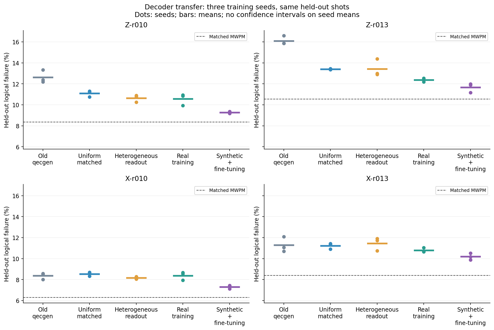
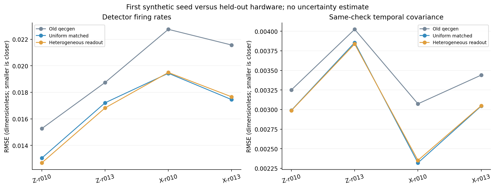
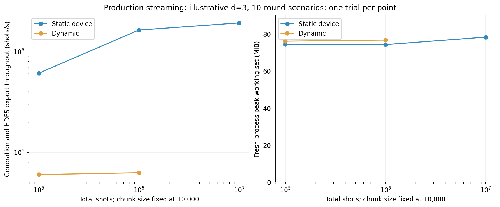

# Device noise, hardware data and decoder transfer

`qecgen generate-config` adds a reproducible device-noise path and checked hardware
import. The original commands and their seeded legacy streams remain available.
More mechanisms make a model more expressive; they do not prove that its output
matches hardware. The experiments below measure that distinction.

This implementation targets **superconducting surface-code memory experiments**.
Its parameters are explicit assumptions or supplied calibrations. It does not infer
the physical cause of each observed error, simulate a cryostat, or claim a universal
model for every quantum-computing technology.

## What the decoder actually learns

A shot is one memory experiment containing repeated checks. A detection event says
that a check disagreed with its expected parity. It does not identify the failed
qubit. The target says whether the final logical observable flipped. Several
physical causes can produce the same evidence, so matching detector frequencies
does not identify those causes. The existing [data contract](../DATA_CONTRACT.md)
still applies: events are inputs and logical flips are targets (Contract A).

The fast backend represents errors as random **Pauli operations**: X changes a
computational bit, Z changes its relative phase, and Y combines those effects.
That representation is convenient for simulation but can discard state dependence,
such as the difference between losing energy from an excited qubit and acting on
a qubit already in its ground state. The reference experiment below measures one
such discrepancy. [Ghosh, Fowler and Geller](https://arxiv.org/pdf/1210.5799)

An exact supported static detector error model can additionally produce its own
abstract mechanism labels (Contract B). Dynamic hidden-state simulations and
hardware imports provide Contract A only. A leakage-effect flag is a simulator
assumption, not a measured physical-fault label.

The old generator was already circuit-level by default: it applied one common
probability to data, gate, reset and measurement channels. Its limitation was the
uniform convention and absence of evolving device processes, rather than absence
of circuit-level noise. Code capacity remains a separate, simpler legacy preset.

## Why errors happen, and what this model represents

| Mechanism | Evidence and meaning | Implemented control and limitation |
|---|---|---|
| Relaxation and dephasing | T1 describes energy relaxation; T2 describes loss of phase coherence. Their effect depends on elapsed time. [Ghosh, Fowler and Geller, Eq. 10](https://arxiv.org/pdf/1210.5799) derives a Pauli approximation. | `coherence` supplies per-qubit `t1_s`, `t2_s` and explicit layer durations. The approximation loses directional relaxation; it is not exact amplitude damping. |
| Operation errors | The Willow error budget separates gates, measurement, reset, idling and unwanted interactions. [Published Willow study](https://www.nature.com/articles/s41586-024-08449-y) | `probabilities`, `qubit_overrides` and `edge_overrides` separate operation and location. Aggregate gate-error measurements cannot be added to coherence loss without checking for double counting. |
| Leakage | Population can leave the two computational states and affect later operations. Removal operations reduce its spread. [Miao et al.](https://arxiv.org/abs/2211.04728) | `leakage` is an experimental hidden-state proxy for persistent error effects and directed neighbor effects. It does not simulate a third energy level or coherent leakage. |
| Correlated interactions | Willow reports unwanted interactions; particle-associated events can disturb separated qubits. [Willow](https://www.nature.com/articles/s41586-024-08449-y), [Wilen et al.](https://arxiv.org/abs/2012.06029) | `spatial` specifies a joint Pauli event on named qubits. `bursts` specifies a persistent event on a supplied footprint. Neither derives a coupling law from distance. |
| Drift | Measured relaxation times vary spectrally and over time. [Carroll et al.](https://arxiv.org/abs/2105.15201) The later control study distinguishes natural drift from deliberately injected disturbances. [Google Quantum AI](https://arxiv.org/html/2511.08493v4) | `drift` is an experimental autoregressive process in log-odds, updated between shots. Its coefficients are scenario assumptions unless fitted to appropriate histories. |

### The four requested environmental factors

**Qubit transition frequency** is an operating point, in hertz, recorded under
`covariates.transition_frequency_hz` by qubit index. Frequency-dependent relaxation
and defects are experimentally observed, but frequency alone does not determine
error probability. Supply a measured T1/T2 response or operation calibration for
that operating point. The code applies no universal frequency multiplier.
[Carroll et al.](https://arxiv.org/abs/2105.15201)

**Syndrome extraction frequency** means rounds per second. The timing audit derives
round durations and rates from `coherence.layer_durations_s` and
`round_end_layers`. It is distinct from qubit transition frequency. Changing the
round count changes an experiment's length; it does not make gates faster. A timing
study must explicitly change the duration schedule and justify the corresponding
gate calibrations. Zero-duration or unspecified schedules do not establish a
physical round rate.

**Temperature** is recorded separately as `cryostat_temperature_k` and
`effective_qubit_temperature_k`. These are not interchangeable with room or control
instrument temperature. Temperature-dependent relaxation fluctuations have been
measured, but this does not justify a universal temperature-to-error conversion.
Both fields have zero automatic effect. The backend has no calibrated thermal
excitation channel; use a separate validated model when that state dependence is
important. [Zhu et al.](https://arxiv.org/html/2409.09926v2)

**Humidity** is a recorded fraction from 0 to 1 under
`humidity_relative_fraction`, with **zero automatic effect**. Evidence for a direct
effect on qubits inside their cryogenic vacuum environment is weak. One retrieved
experiment switched laboratory air conditioning and observed coherent measurement
drift while temperature and humidity changed together. It does not isolate
humidity or establish a direct coupling to the qubits. Consequently, no humidity
error law is implemented. [Di Giovanni et al., published Appendix G](https://journals.aps.org/prapplied/pdf/10.1103/dpft-lxtx)

**Spatial proximity** is represented by explicit topology, operation edges and
correlated-event footprints. Nearby qubits are not assigned extra noise just for
being nearby. A user-supplied spatial event must identify its basis as `measured`
or `scenario_assumption`; that declaration is provenance, not automatic evidence
verification. [Wilen et al.](https://arxiv.org/abs/2012.06029)

## Run a configuration

From the repository root:

```powershell
python -m qecgen.cli generate-config --config examples/legacy.json
python -m qecgen.cli generate-config --config examples/device-static.json
```

The examples are illustrative scenarios, not fitted device calibrations. The
configuration resolves defaults before generation and records the resolved values,
seed, chunk size, source identity and engine versions in metadata. The local UI's
configured-run mode uses the same domain path. Files are published through the
existing staging/exporter system.

In the web UI, open **Device & hardware** for forms covering the operation rates,
per-qubit and gate-pair overrides, T1/T2 and layer timing, shared events, drift,
bursts, leakage effects, and environmental covariates. **Show circuit qubits and
layers** lists the actual indices and timing-array length, including check qubits;
it does not supply calibration values. Hardware mode exposes the source files,
checksums, cohort identity, row offset and import count. JSON import/export and an
advanced editor remain available alongside the forms.

**Sweep one parameter** previews separate dataset jobs with indexed filenames and
derived seeds before queueing them. A sweep is not a threshold-decoding study.
Each job can be inspected or cancelled in Runs. Browser-entered integers are
restricted to JavaScript's exact range (up to 9007199254740991); use the CLI for
larger base seeds. Server-derived sweep seeds retain their full 64-bit values,
including in saved configurations and the run-record display. At most 100 points
can be queued in one web-UI sweep.

The JSON has `version: 1`; its exported manifest has `manifest_version: 2`,
`generation_config` and `generation_audit`. Paths resolve against the working
directory, not the configuration file's directory. Device mode requires
`parameter_provenance` identifying a scenario, measured values or a training-only
fit. This declaration makes assumptions auditable; it cannot certify a user's
calibration as true. Unknown fields and unsupported combinations are rejected.

Configured runs contain one environment and do not implement `FROZEN_PRIOR` or
`ORACLE_CALIBRATED` drift studies. Their configuration is visible metadata; do not
feed it to a decoder whose evaluation is meant to withhold the noise model. The
old `drift` API is unchanged. Legacy circuit-rebuilding `benchmark` and QA refuse
new model kinds; the research transfer harness constructs its declared training-only
priors. Correction scoring remains supported for generated canonical device circuits,
but refuses hardware and external-circuit inputs whose data-qubit roles have not
been audited for that different operation.

Three modes separate their scientific meaning:

| Mode | Input | Meaning |
|---|---|---|
| `legacy` | Existing circuit/noise settings | Reproduce the original generator's conventions and sampling stream. |
| `device` | Ideal circuit definition and a `NoiseProfile` | Simulate the explicitly supplied mechanism assumptions. |
| `hardware` | Supported source files and expected SHA-256 values | Import measured outcomes with source lineage; do not manufacture fault labels or an exact hardware DEM. |

External device circuits are limited to checked canonical Stim layouts or the four
catalogued Willow circuits with verified hashes and identities. Arbitrary circuits
are refused. Hardware tables matching the four catalogue hashes carry the verified
derived-source attribution; other supplied tables are marked user-supplied rather
than automatically assigned Google's DOI or licence.

Read the example JSON and resolved configuration together before a large run.
Source-backed configurations require the referenced, checksum-matching source
bytes as well as the JSON and seed. Changing chunk size, engine version or machine
characteristics can change Stim's sample stream; byte-identical container files
are not promised. [Stim 1.16 seeded-sampling restrictions](https://raw.githubusercontent.com/quantumlib/Stim/v1.16.0/doc/python_api_reference_vDev.md)

### Toggle and sweep mechanisms independently

All unspecified operation probabilities are zero. To disable an operation family,
set its global and relevant override probabilities to zero. Overrides replace the
global value at their locations; they are not additional independent errors.
Set a `spatial` entry's `enabled` to false, or remove it, to disable that correlation.
Set each dynamic block's
`enabled` to false to disable it. Change one family per configuration and keep
seed, source, sample count and chunk size recorded for each sweep point.

The Python helper expands a sweep into independent, fully resolved configurations:

```python
from pathlib import Path
from qecgen.configuration import expand_sweep, read_config
from qecgen.run import ConfiguredSpec, run

base = read_config(Path("examples/device-static.json"))
for config in expand_sweep(base, "noise.probabilities.measurement", [0.001, 0.003, 0.01]):
    run(ConfiguredSpec(config))
```

The values above are illustrative. The helper derives child seeds deterministically
and gives outputs distinct indexed names. Each resulting configuration is recorded
in its file. A humidity-only sweep changes recorded covariates, not the physics;
distinct child seeds can still change finite-sample outcomes.

| Profile block | Controls |
|---|---|
| `probabilities` | `one_qubit_gate`, `two_qubit_gate`, `measurement`, `reset`, `idle` |
| `qubit_overrides` | Canonical qubit index strings; operation probabilities for that qubit |
| `edge_overrides` | Canonical `"smaller,larger"` qubit pair; two-qubit gate probability |
| `coherence` | Per-qubit T1/T2, `exponential_ramsey` T2 protocol, complete layer schedule; requires a declaration that residual gate errors exclude modeled decoherence |
| `spatial` | Optional `enabled`, named qubits, one X/Y/Z per qubit, joint probability and evidence basis |
| `drift` | Affected qubits, Pauli, baseline probability, autoregression `rho`, log-odds innovation `sigma_logit` |
| `bursts` | Affected qubits, Pauli, onset, recovery and effect probabilities |
| `leakage` | Entry, recovery, reset removal, local effect and directed neighbor-effect probabilities |
| `covariates` | Recorded transition frequencies, temperatures and humidity; no automatic coupling |

The time axes differ deliberately: drift and burst states evolve across shot
indices and remain constant within a shot. Leakage state starts fresh per shot
and evolves across circuit layers. These are not wall-clock calibrated processes.
Do not interpret shot-index persistence as evidence of a physical timescale.
Operation probabilities apply per applicable operation; `idle` applies to inactive
qubits in a circuit layer, and each spatial event is attempted once per physical
layer. Drift and active bursts supply additional per-layer Pauli-effect
probabilities while their shot-level state stays fixed. Leakage entry, recovery
and effect probabilities apply on its layer updates, with an extra reset-removal
step at resets. These probabilities are not interchangeable with per-shot rates.

Classical sweep controls in supported hardware circuits require the explicit
`ideal_pauli_frame` policy. This preserves their ideal frame role under the
state-independent Pauli approximation. It does not establish equivalence for
state-dependent thermal noise or full leakage dynamics.

## Published data: what was verified and downloaded

The [source catalogue](../research/realism/sources.json) pins versions, licences,
URLs, expected sizes and available publisher checksums. Each actual download has a
local receipt containing its own SHA-256. Raw bytes and receipts are under the
gitignored `data/realism` directory. A catalogue entry is not a completed download.

| Lead | Verified source | Acquisition status in this project |
|---|---|---|
| arXiv:2207.06431 | [Google 2022, Zenodo 6804040](https://doi.org/10.5281/zenodo.6804040), CC BY 4.0; d=3/5 surface-code and repetition-code material | Original archive request blocked by HTTP 403. The reported high-energy event was not independently reanalysed here. |
| arXiv:2408.13687 | [Willow, Zenodo 13273331](https://doi.org/10.5281/zenodo.13273331), CC BY 4.0; d=3/5/7 | Original archive blocked by HTTP 403. Four smaller third-party-derived d=3 cohorts were acquired instead. |
| arXiv:2412.14360 | [Dynamic circuits, Zenodo 14238907](https://doi.org/10.5281/zenodo.14238907), CC BY 4.0; displayed archive 2.1 GB | Catalogued; archive download deferred. No dynamic-circuit hardware validation claimed. |
| arXiv:2511.08493 | [Reinforcement learning, Zenodo 18896801](https://doi.org/10.5281/zenodo.18896801), version 2, CC BY 4.0; displayed archive 7.8 GB | Catalogued; archive download deferred. Natural and injected drift must be distinguished. |

The acquired [derived Willow dataset](https://huggingface.co/datasets/ShayManor/willow-surface-code-detection-events/tree/79ea4cbbc278047c9ce5d4d74d79a0f38aa28c7c)
contains four selected cohorts: X/Z memory, 10/13 rounds, d=3, q10_7, 50,000 shots
each. Preserve original Google CC BY attribution alongside the mirror's Apache
2.0 declaration. Its author publishes conversion checks against Google data, but
this project could not compare original archive bytes independently. The associated
[September 2026 study](https://arxiv.org/abs/2609.04557) is a newer, directly relevant
source; its reported results are not substituted for our own measurements.

The [official IBM Manila snapshot](https://github.com/Qiskit/qiskit-ibm-runtime/tree/5b6e7cae8e457ab91c238e50eed0bd9e2044c5d0)
contains measured calibration properties, including frequency, coherence and
operation/readout errors, captured in 2024. The
[calibration history archive](https://huggingface.co/datasets/phanerozoic/qiskit-calibration-drift/tree/d7180c868a7d692675123518be4ad8f9a6266c66)
supplies time series across four IBM backends, but no frequency family. These
devices are not the Willow device: their values are not transplanted into a
purported Willow calibration. The history has column-specific licence terms;
weather and the noncommercial sunspot column are excluded from our model fitting.

Fourteen assets total 58,895,044 acquired bytes. Calibration analysis deduplicates
API observations by calibration identity, normalizes documented units and splits
each backend chronologically. Repeated API polling is not repeated physical
calibration. Of 3,686 sufficiently populated series, a last-observation forecast
beats a fixed training mean in 1,377 and loses in 2,309. Drift persistence is not a
universal improvement. See the acquired calibration analysis and the historical
[design report](../research/realism/GATE2_REPORT.md).
The last-observation predictor updates only from earlier observations available at
the forecast time, including preceding held-out observations; the training-mean
predictor remains frozen. This is online forecasting, not retrospective fitting
to future calibration values.

## Validation protocol and measured results

The final experiment compares old qecgen after an audited detector mapping,
uniform noise on the experimental circuit, fitted per-qubit readout noise,
real-only decoder training, and synthetic pretraining followed by real fine-tuning.
All noise fitting uses training shots. Checkpoint selection uses validation shots.
The complete implementation/configuration/checkpoint set is sealed before any test
scoring. No further fitting is justified by the test results.
Every arm uses real validation data for checkpoint selection, and synthetic noise
parameters are fitted to real training data. These are hardware-calibrated
development comparisons, not zero-shot transfer or a claim that no real data are
needed. Increasing the GRU size does not by itself establish a stronger decoder.
The old-generator arm retains its original four-channel circuit construction and
fits its single probability to real training marginals. Its detector permutation
and observable convention are audited before training. The comparison therefore
includes both noise-convention and circuit-schedule differences; it is not a claim
that every operation in the legacy circuit matches Willow hardware.

Each cohort preserves source row order, with guarded contiguous train/validation/
test blocks. There are 29,872 training, 9,744 validation and 9,872 test rows per
cohort; 512 boundary rows are omitted. Four cohorts give 39,488 distinct test rows.
The source lacks trustworthy acquisition timestamps and independent run IDs, so
these are **row-block holdouts**, not proved temporal or independent-device
generalization. Three training seeds reuse the same test rows and must not be
counted as three times as much independent evidence.

Logical failure probability is the fraction of held-out shots decoded incorrectly.
We also compare detector firing rates, spatial/temporal pair covariances and
syndrome-weight tails, motivated by the experimental analyses in the
[2022 Google](https://arxiv.org/abs/2207.06431) and
[Willow](https://www.nature.com/articles/s41586-024-08449-y) studies. Agreement of
one marginal statistic alone is insufficient. Reported per-shot binomial intervals
are descriptive; row-block sensitivity intervals show dependence on assumed block
length and do not prove independent sampling. No per-round logical-rate fit is
claimed from only two durations.

<!-- REALISM_RESULTS_START -->
The sealed final experiment completed 60 training/fine-tuning runs across four
cohorts. The table shows each arm's mean over three seeds and its individual
failure counts (seeds 17, 29, 43), all on the same 9,872 test shots within that cohort.

| Cohort | Training arm | Failures by seed | Mean failure |
|---|---|---|---|
| Z-r010 | Old qecgen | 1204, 1315, 1222 | 12.632% |
| Z-r010 | Uniform matched | 1108, 1115, 1061 | 11.089% |
| Z-r010 | Heterogeneous readout | 1063, 1074, 1013 | 10.636% |
| Z-r010 | Real training | 1071, 981, 1079 | 10.572% |
| Z-r010 | Synthetic + fine-tuning | 913, 925, 906 | 9.265% |
| Z-r013 | Old qecgen | 1565, 1637, 1566 | 16.099% |
| Z-r013 | Uniform matched | 1328, 1320, 1319 | 13.395% |
| Z-r013 | Heterogeneous readout | 1283, 1419, 1274 | 13.425% |
| Z-r013 | Real training | 1204, 1222, 1237 | 12.368% |
| Z-r013 | Synthetic + fine-tuning | 1183, 1173, 1102 | 11.676% |
| X-r010 | Old qecgen | 841, 791, 847 | 8.370% |
| X-r010 | Uniform matched | 858, 822, 847 | 8.533% |
| X-r010 | Heterogeneous readout | 806, 795, 818 | 8.168% |
| X-r010 | Real training | 844, 855, 784 | 8.384% |
| X-r010 | Synthetic + fine-tuning | 734, 702, 727 | 7.303% |
| X-r013 | Old qecgen | 1193, 1056, 1093 | 11.284% |
| X-r013 | Uniform matched | 1119, 1128, 1076 | 11.220% |
| X-r013 | Heterogeneous readout | 1176, 1061, 1158 | 11.463% |
| X-r013 | Real training | 1052, 1091, 1055 | 10.798% |
| X-r013 | Synthetic + fine-tuning | 1039, 1004, 976 | 10.194% |



Equal-weight averages across cohorts and seeds are descriptive, not pooled
independent observations:

| Training arm | Mean across four cohorts and three seeds |
|---|---|
| Old qecgen | 12.097% |
| Uniform matched | 11.059% |
| Heterogeneous readout | 10.923% |
| Real training | 10.531% |
| Synthetic + fine-tuning | 9.610% |

The heterogeneous-readout arm is **0.1359 percentage points better**
than uniform noise on the same experimental circuit on this descriptive average.
This does not identify a physical cause or establish performance on other devices.
By cohort mean, heterogeneous readout improves over Old qecgen in Z-r010, Z-r013, X-r010 and worsens in X-r013.
By cohort mean, heterogeneous readout improves over Uniform matched in Z-r010, X-r010 and worsens in Z-r013, X-r013.
Across the 12 cohort/seed pairs, 9 improve and 3 worsen;
0 tie. Fine-tuning is 0.9210 percentage points
better than real-only training on the same descriptive average.
The real-trained GRU is worse than matched uniform MWPM in 12/12
runs. A validation plateau therefore does not establish decoder competence.

| Cohort | Matched uniform MWPM | Matched heterogeneous MWPM | Old-qecgen MWPM |
|---|---|---|---|
| Z-r010 | 8.357% | 8.357% | 11.224% |
| Z-r013 | 10.545% | 10.545% | 14.212% |
| X-r010 | 6.291% | 6.291% | 6.696% |
| X-r013 | 8.397% | 8.428% | 8.914% |

The paired differences below compare the same shots. Negative values favor
the first arm. Intervals resample source-row blocks of 512; the committed
summary also retains 128-row intervals and per-arm descriptive binomial
intervals. Block resampling is a sensitivity analysis, not proof that blocks
are independent hardware acquisitions.

| Cohort | Seed | Comparison | Difference (percentage points) | 512-row interval |
|---|---|---|---|---|
| Z-r010 | 17 | Heterogeneous - uniform | -0.456 | [-0.881, -0.033] |
| Z-r010 | 17 | Fine-tuned - real | -1.600 | [-1.992, -1.157] |
| Z-r010 | 29 | Heterogeneous - uniform | -0.415 | [-0.843, -0.010] |
| Z-r010 | 29 | Fine-tuned - real | -0.567 | [-1.007, -0.091] |
| Z-r010 | 43 | Heterogeneous - uniform | -0.486 | [-0.902, -0.020] |
| Z-r010 | 43 | Fine-tuned - real | -1.752 | [-2.273, -1.246] |
| Z-r013 | 17 | Heterogeneous - uniform | -0.456 | [-0.928, +0.010] |
| Z-r013 | 17 | Fine-tuned - real | -0.213 | [-0.852, +0.379] |
| Z-r013 | 29 | Heterogeneous - uniform | +1.003 | [+0.449, +1.562] |
| Z-r013 | 29 | Fine-tuned - real | -0.496 | [-1.025, +0.068] |
| Z-r013 | 43 | Heterogeneous - uniform | -0.456 | [-0.996, +0.111] |
| Z-r013 | 43 | Fine-tuned - real | -1.368 | [-1.758, -0.947] |
| X-r010 | 17 | Heterogeneous - uniform | -0.527 | [-0.851, -0.213] |
| X-r010 | 17 | Fine-tuned - real | -1.114 | [-1.469, -0.770] |
| X-r010 | 29 | Heterogeneous - uniform | -0.274 | [-0.610, +0.077] |
| X-r010 | 29 | Fine-tuned - real | -1.550 | [-1.981, -1.123] |
| X-r010 | 43 | Heterogeneous - uniform | -0.294 | [-0.621, +0.030] |
| X-r010 | 43 | Fine-tuned - real | -0.577 | [-0.861, -0.284] |
| X-r013 | 17 | Heterogeneous - uniform | +0.577 | [+0.127, +1.023] |
| X-r013 | 17 | Fine-tuned - real | -0.132 | [-0.674, +0.469] |
| X-r013 | 29 | Heterogeneous - uniform | -0.679 | [-1.378, +0.051] |
| X-r013 | 29 | Fine-tuned - real | -0.881 | [-1.389, -0.358] |
| X-r013 | 43 | Heterogeneous - uniform | +0.831 | [+0.221, +1.348] |
| X-r013 | 43 | Fine-tuned - real | -0.800 | [-1.256, -0.312] |



Distribution metrics use only the first synthetic seed. The committed summary
also retains spatial and spacetime covariance errors and syndrome-weight tails.
These comparisons have no estimated sampling uncertainty.

Recorded training/fine-tuning time: **952.8 seconds**;
complete experiment wall time: **1012.0 seconds**.
Recorded stopping reasons: validation_patience: 60.
The checkpoint lock and source-artifact SHA-256 values are retained in
[the committed aggregate summary](evidence/realism-summary.json).
Full checkpoints and per-shot failure vectors remain in ignored local results.

For all eight fitted static profiles (two models by four cohorts), a separate
production/prototype check found exact noisy-circuit text, detector arrays,
observable arrays and content hashes at 10,000 shots, seed 20260927 and
10,000-shot chunks. No held-out hardware outcomes entered that check. This
links these evaluated static profiles to production; it is not a validation
of every dynamic process or a guarantee across runtime versions.
<!-- REALISM_RESULTS_END -->

The fitted heterogeneous arm varies **effective readout probabilities only**.
Full physical causes, leakage, bursts, temperature responses and coherent errors
were not identified from these data. A real-trained decoder that underperforms
matching limits the strength of any conclusion about generator quality. Fine-tuning
also uses extra real supervision and compute, so it is not a zero-real-data arm.

## Approximation checks and performance

The small density-matrix reference implements the stated two-level damping and
dephasing channels exactly; it is not exact transmon physics. With illustrative
1 microsecond idles, T1=20 microseconds and T2=30 microseconds, the Pauli
approximation excites a ground state with probability 0.024385, while the exact
zero-temperature damping reference leaves it in the ground state. In the
three-round parity motif, joint-outcome total variation is 0.13768 for preparation
00 and 0.12485 for 11. These are approximation diagnostics with arbitrary example
parameters, not measured device rates or decoded logical failure rates.

The static backend compiles a noisy circuit once and samples chunks. Dynamic
hidden-state effects use a slower path; HDF5 streaming bounds shot-buffer memory.
Use production timing measurements for your distance, round count, mechanisms
and chunk size rather than extrapolating from the small pilot. The historical
100,000-shot d=3/r=10 pilot measured about 2.07 million static-uniform shots/s,
2.00 million heterogeneous shots/s and 71,100 dynamic shots/s on this CPU. Those
single-run prototype measurements include uncontrolled background activity and
do not describe large-distance production performance.

<!-- REALISM_PERFORMANCE_START -->
| Model | Format | Shots | Shots/s | Peak working set (MiB) |
|---|---|---|---|---|
| static device | hdf5 | 100,000 | 607,562 | 74.39 |
| static device | hdf5 | 1,000,000 | 1,628,178 | 74.32 |
| static device | hdf5 | 10,000,000 | 1,910,146 | 78.30 |
| dynamic | hdf5 | 100,000 | 60,144 | 76.14 |
| dynamic | hdf5 | 1,000,000 | 62,600 | 76.74 |
| legacy | hdf5 | 1,000,000 | 3,017,574 | 74.07 |
| static device | npz | 100,000 | 495,408 | 75.47 |
| dynamic | npz | 100,000 | 57,920 | 75.86 |



Measurements include generation and export, with 10,000-shot chunks, d=3
and 10 rounds. Peak working set includes interpreter/imports. The static
and dynamic 100,000-shot HDF5/NPZ pairs reproduced identical arrays and
content hashes. Single trials under concurrent machine activity do not
establish a latency guarantee or predict larger-distance cost. Static and
legacy profiles also contain different operation probabilities, so their
throughput ratio is not a controlled implementation-only comparison.
<!-- REALISM_PERFORMANCE_END -->

## Reproduce and extend the study

```powershell
# Acquire the four checked cohorts and their circuits.
python -m research.realism.acquire willow-derived-x-r010 willow-derived-x-r010-circuit `
  willow-derived-z-r010 willow-derived-z-r010-circuit `
  willow-derived-x-r013 willow-derived-x-r013-circuit `
  willow-derived-z-r013 willow-derived-z-r013-circuit willow-derived-readme
python -m research.realism.calibration_analysis --help

# The experiment uses an isolated environment with the recorded PyTorch/CUDA build.
.\data\realism\.venv\Scripts\python.exe -m research.realism.evaluate --help

# Redraw committed figures from the small committed aggregate summary.
python docs/make_realism_report.py
```

The executed experiment configuration is
[`research/realism/evaluation_config.json`](../research/realism/evaluation_config.json).
On a machine with the base pinned dependencies already installed, the isolated
CUDA environment can be reproduced with:

```powershell
python -m venv --system-site-packages data/realism/.venv
.\data\realism\.venv\Scripts\python.exe -m pip install torch==2.11.0+cu128 `
  --index-url https://download.pytorch.org/whl/cu128
```

The general `research` extra installs the pinned PyTorch release; exact CUDA replay
also needs the recorded build and compatible machine/driver. The reference run
used Python 3.13.6, Stim 1.16.0 and a 4090 Laptop GPU; the aggregate summary records
all observed versions. This environment does not replace the production generator's
CPU sampling dependency set.

`research/realism/evaluate.py` refuses to overwrite or rescore an existing
experiment directory. Copy the recorded configuration and choose a new output
directory for a replay. Preserve the acquisition receipts, pinned source files,
library/build versions, seeds, chunk sizes, decoder settings, split definitions
and checkpoint hashes. The final summary contains hashes of the full evidence
artifacts but no per-shot data.

Exact producer source bytes are saved with the recorded experiment. After that
run, two integrity guards were added: refusing incomplete or over-budget study
configurations and checking saved source bytes against their hashes. Sampling,
training and scoring arithmetic were unchanged. The local
`data/realism/results/final-evaluation/post-run-producer.json` records the original
and subsequent producer identities separately; the original results and source
snapshots remain intact.

Future claims need independently verified original source bytes, acquisition
groups and timestamps, more distances/devices, calibrated mechanism families and
a sufficiently competent decoder. A failed or unchanged comparison is a useful
result: it prevents adding unsupported complexity to a downstream model search.
